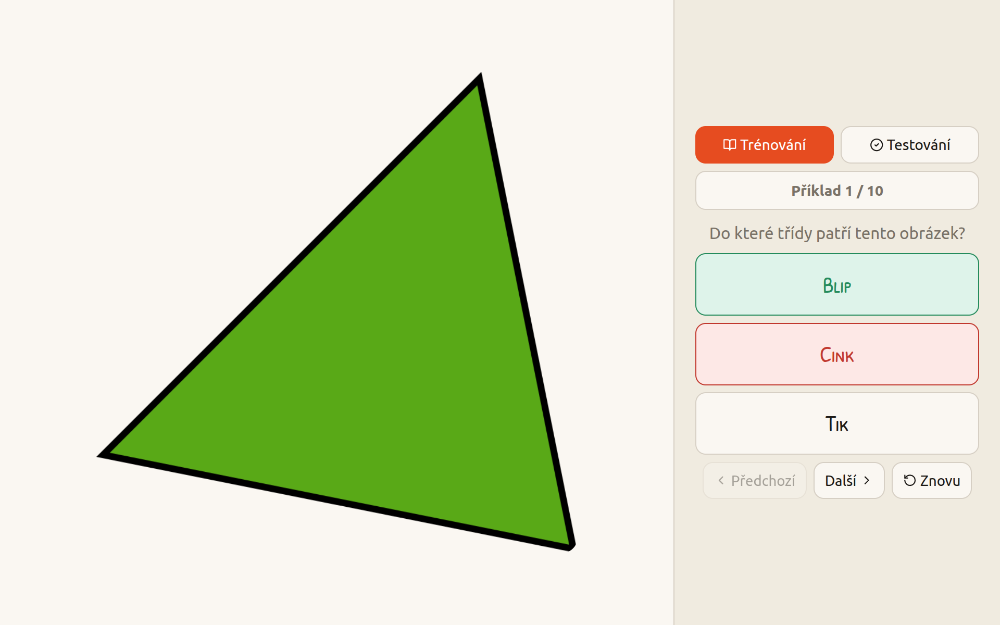

# ML Quiz

An interactive quiz that teaches you how machine learning classification works.



You are shown an image and asked to pick which class it belongs to. First you go through a **training set** to build your intuition, then a **test set** to see how well you've learned the pattern. It's the same workflow a machine learning model follows when it's trained and evaluated.

The quiz is available in Czech and English:

- **Czech:** [zdenekkasner.cz/ml-demo/](https://zdenekkasner.cz/ml-demo/)
- **English:** [zdenekkasner.cz/ml-demo/en/](https://zdenekkasner.cz/ml-demo/en/)

## Run it locally

You can simply open `index.html` in your browser.


You can also use Python. Run:

```bash
python3 -m http.server 4173
```

Then open `http://127.0.0.1:4173/` in your browser.
